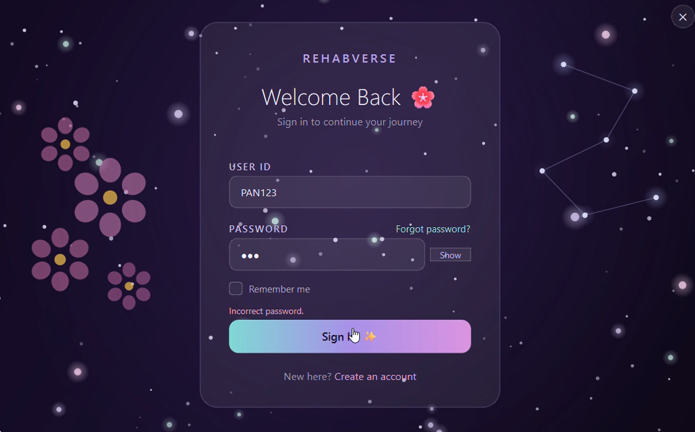
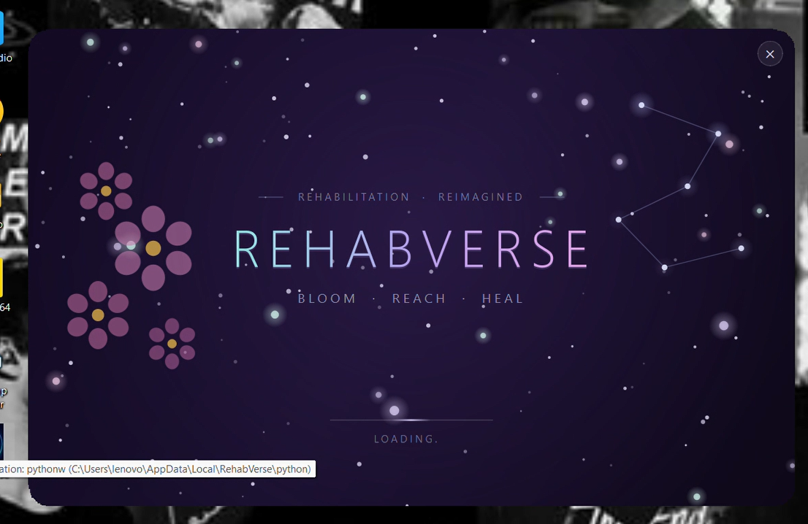
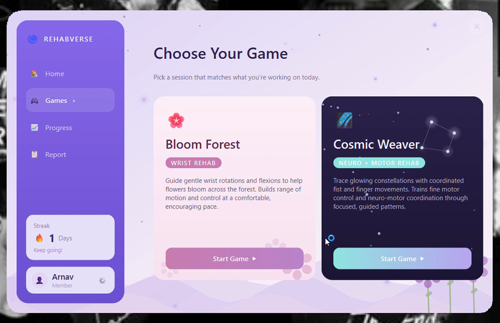
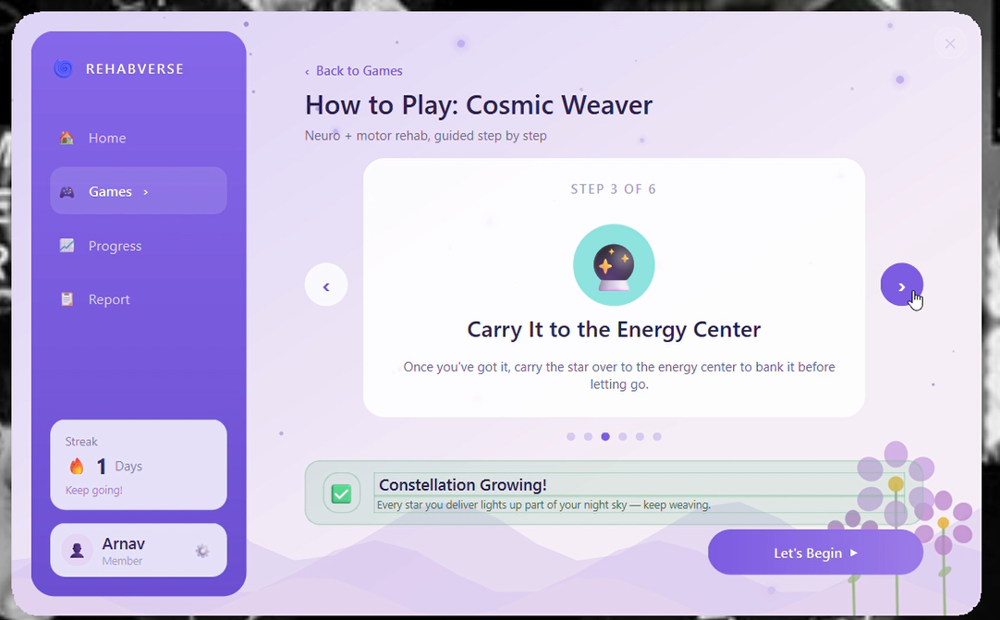
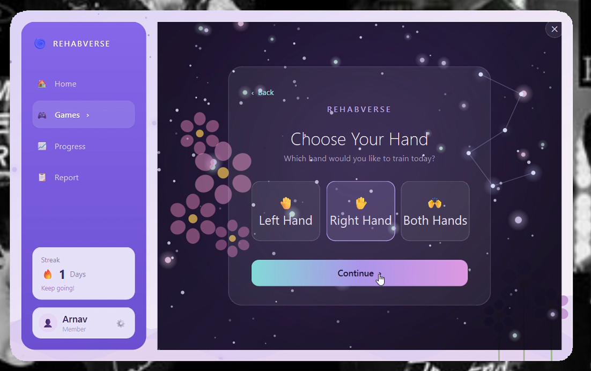
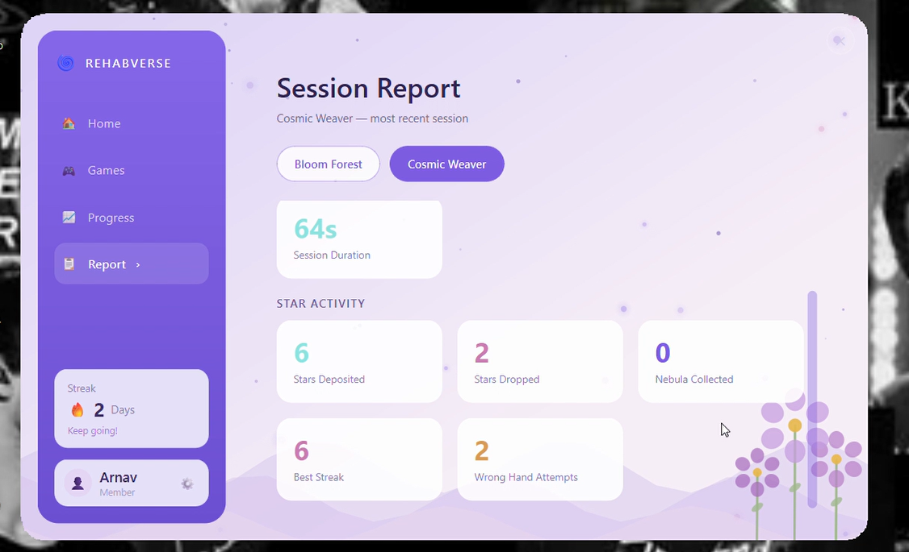
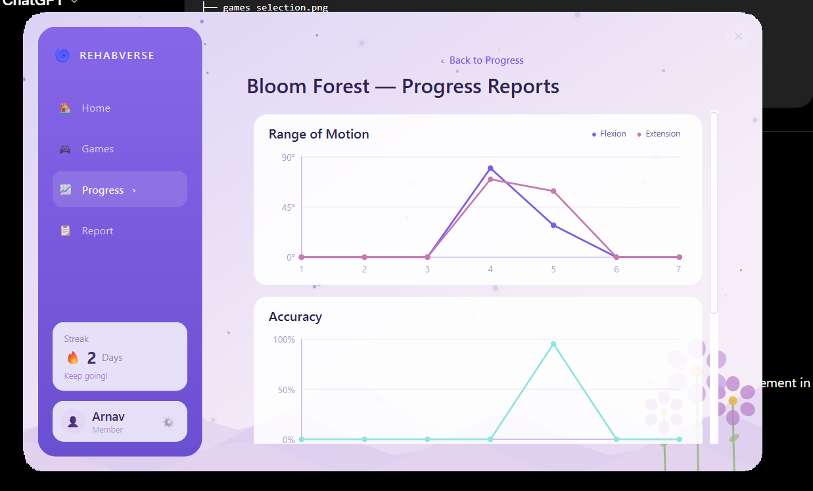
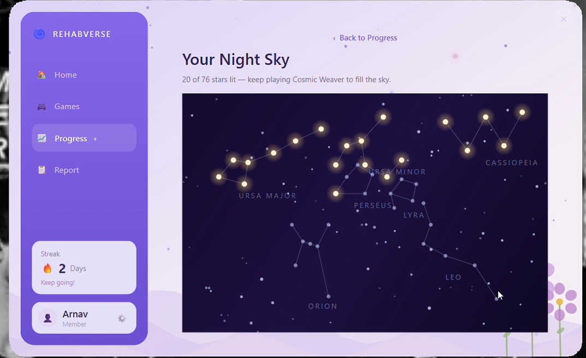

## Demo Video

Experience RehabVerse in action — from user login and game selection to
real-time webcam-based rehabilitation gameplay and progress tracking.

The demo showcases:
- PyQt6 dashboard navigation
- Unity-based rehabilitation games
- Real-time MediaPipe hand tracking
- Session recording and performance reports
- Long-term progress visualization

▶️ **Watch the Demo:**  
[RehabVerse Demo Video](https://drive.google.com/drive/folders/15Mbob_l5MZFy-xkItwvLPCobi1phdm26?usp=sharing)

# RehabVerse

RehabVerse is a gamified rehabilitation platform that pairs **Unity-based
motion games** with **real-time computer-vision hand tracking** to guide
wrist and motor rehab exercises. A **PyQt6 desktop dashboard** ties
everything together — login, game launching, session history, and
progress tracking — all backed by **MongoDB**.

---

## Overview

The player signs into the desktop app, picks a game, and plays it using
just their webcam — no controllers or wearables. A Python computer-vision
backend (OpenCV + MediaPipe) tracks hand position, grip strength, and
fist state in real time, and streams that data to the matching Unity
build over UDP. Unity owns the actual gameplay logic (spawning, scoring,
collision) locally, and reports session results back to Python, which
saves them to MongoDB for the dashboard to display.

User authentication and personalized access to the RehabVerse platform:



The main dashboard provides access to games, reports, and rehabilitation progress:



## Games

| Game | Focus | Description |
|---|---|---|
| **Bloom Forest** | Wrist rehab | Guided wrist flexion/extension reps. Hold a target angle steadily to grow a flower each round — steadier holds bloom fuller flowers. |
| **Cosmic Weaver** | Neuro + motor rehab | Reach, grip, and carry glowing stars to an energy center before they fade, using whichever hand the game calls out. Purple nebula stones are worth bonus points; dropping a star or using the wrong hand doesn't count. |

Players can choose from available rehabilitation games:



Game-specific instructions and hand preference selection for personalized training:




**Bloom Forest — Wrist Rehabilitation:** wrist movements are transformed
into an interactive plant growth experience.
*(Add Bloom Forest gameplay screenshot here)*

**Cosmic Weaver — Motor Rehabilitation:** players interact with objects
using real-time hand tracking.
*(Add Cosmic Weaver gameplay screenshot here)*

## Architecture

```
┌─────────────────┐      UDP         ┌─────────────────┐
│  Python backend │  ─────────────▶  │  Unity game     │
│  (OpenCV +      │     (5052)       │  (gameplay logic,│
│   MediaPipe)    │ ◀─────────────   │ scoring, spawn) │
└────────┬────────┘   UDP (5054)     └─────────────────┘
         │  session save (on exit)
         ▼
┌──────────────────┐
│    MongoDB       │
│  users / sessions│
└────────┬─────────┘
         │  reads
         ▼
┌──────────────────┐
│  PyQt6 Dashboard │
│  (login, games,  │
│ progress, report)│
└──────────────────┘
```

- **Python → Unity (port 5052):** normalized hand positions, fist/grip
  state, tracking status, chest position, and adaptive difficulty config
  — sent continuously, every frame.
- **Unity → Python (port 5054):** periodic score/streak/session
  checkpoints and a final report when the session ends — Unity is the
  local authority on all real-time gameplay decisions (pickup, deposit,
  drop, required-hand selection).
- **Python → MongoDB:** each controller script saves one session
  document per playthrough, and reads the player's most recent session
  to adjust difficulty for the next one.
- **PyQt6 Dashboard → MongoDB:** reads for login/registration, session
  history, streaks, and per-game stats; never talks to Unity directly.

## Tech Stack

- **Game engine:** Unity (C#)
- **Computer vision backend:** Python, OpenCV, MediaPipe Hands
- **Desktop app:** PyQt6
- **Database:** MongoDB (via PyMongo)
- **Inter-process communication:** UDP sockets (Python ↔ Unity),
  `QProcess`/`subprocess` (dashboard ↔ game processes)

## Features

- **Webcam-only input** — no controllers, calibration-free hand tracking
  with debounced fist detection and orientation-invariant grip strength
- **Adaptive difficulty** — each session's targets (hold time, flexion/
  extension range, grip threshold, star time limit) adjust based on the
  player's previous session performance
- **Required-hand training** (Cosmic Weaver) — the game calls out left,
  right, or either hand per the player's chosen preference
- **Session reports** — per-game breakdown of accuracy, completion rate,
  and game-specific metrics (ROM/flowers for Bloom Forest; score/stars
  for Cosmic Weaver), grouped into readable sections
- **Progress tracking** — current/best streaks, weekly activity, and
  line-chart history per game
- **Night Sky** — a decorative, persistent constellation that lights up
  as the player accumulates score in Cosmic Weaver across sessions,
  spanning two star-map pages
- **Non-blocking UI** — Mongo lookups that happen automatically (e.g.
  right after a game ends) run on background threads, so a slow database
  connection never freezes the dashboard

Each session generates detailed rehabilitation metrics and performance feedback:



Long-term activity, streaks, and performance trends are visualized through graphs:



A persistent constellation view represents accumulated progress across sessions:



## Project Structure

```
RehabVerse/
├── app/                        # PyQt6 desktop dashboard
│   ├── main.py                 # app shell / window, wires everything together
│   ├── login_page.py           # sign-in / registration
│   ├── dashboard_page.py       # sidebar + tab crossfades
│   ├── home_view.py            # Home tab
│   ├── games_view.py           # Games tab (game selection cards)
│   ├── instructions_page.py    # "How to Play" before launching a game
│   ├── hand_preference_page.py # left/right/both choice (Cosmic Weaver)
│   ├── game_report_view.py     # Report tab (per-session metrics)
│   ├── progress_view.py        # Progress tab (streaks, charts, Night Sky)
│   ├── night_sky_view.py       # static full-screen constellation view
│   ├── cosmic_weaver_scene.py  # single-page constellation widget
│   ├── cosmic_weaver_pager.py  # two-page constellation slider
│   ├── session_data.py         # all MongoDB reads for the dashboard
│   ├── auth.py                 # non-blocking login/register logic
│   ├── db.py                   # shared MongoDB connection
│   └── game_launcher.py        # launches a game's Unity build + Python controller
├── games/
│   ├── common/                      # db.py, game_login.py shared by both controllers
│   ├── cosmic_weaver/                # Python controller (cosmic_weaver_controller.py) for Cosmic Weaver
│   └── GAMES/                        # built Unity player output for both games
│       ├── BloomForest_wristrehab/    # wristrehab.exe + Unity player files
│       └── Cosmic_Weaver/             # Cosmic_Weaver.exe + Unity player files
├── python/                       # bundled/portable Python (used by RehabVerse.bat)
├── venv/                         # Python virtual environment (created by RehabVerse.bat)
├── RehabVerse.bat                # one-click setup + launch (Windows)
├── RehabVerse.iss                # Inno Setup script - builds the installer above
├── requirements.txt              # Python dependencies
```


## Setup

1. **Configure `.env`** at the project root:
   ```env
   MONGO_URI=your-mongodb-connection-string

   BLOOM_FOREST_UNITY_EXE=path/to/bloom_forest.exe
   BLOOM_FOREST_PYTHON_SCRIPT=path/to/vines_backend.py

   COSMIC_WEAVER_UNITY_EXE=path/to/cosmic_weaver.exe
   COSMIC_WEAVER_PYTHON_SCRIPT=path/to/tt.py
   ```
   New games only need a matching `<GAME>_UNITY_EXE` / `<GAME>_PYTHON_SCRIPT`
   pair — the launcher picks them up automatically, no code changes needed.

2. **Run `RehabVerse.bat`** (Windows)

   A single batch file at the project root handles both first-time setup
   and every run after that:
   - Creates a `venv/` virtual environment if one doesn't exist yet
   - Activates it and installs dependencies from `requirements.txt`
   - Launches the dashboard (`python app/main.py`)

   Just double-click it (or run `RehabVerse.bat` from a terminal) — no
   manual venv activation needed.

   **Manual equivalent**, if you'd rather do it by hand:
   ```bash
   python -m venv venv
   venv\Scripts\activate
   pip install -r requirements.txt
   python app/main.py
   ```

3. **Packaging a distributable installer** 

   `RehabVerse.iss` is an Inno Setup script that packages the whole app
   into a single installer. Compiling it produces
   `Output/RehabVerseSetup.exe`, which end users can run to install
   RehabVerse without needing Python, a venv, or any of the setup above -
   everything needed is bundled inside the installer.

## How a Session Flows

1. Player logs in (or registers) via the dashboard.
2. They pick a game, read the instructions, and (for Cosmic Weaver) choose
   a hand preference.
3. The dashboard launches the Unity build and its matching Python
   controller side by side, passing the player's user ID (and hand
   preference, if applicable).
4. The Python controller tracks the webcam feed and streams data to
   Unity; Unity runs the actual game and reports results back.
5. When the player quits or the session ends, the controller saves the
   session to MongoDB and exits — which closes the matching Unity window
   and brings the dashboard back to the front.
6. The dashboard jumps straight to that game's Report tab with the
   just-saved session's real metrics.